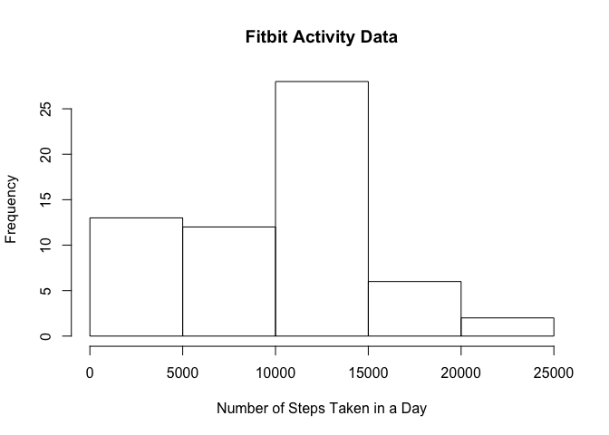
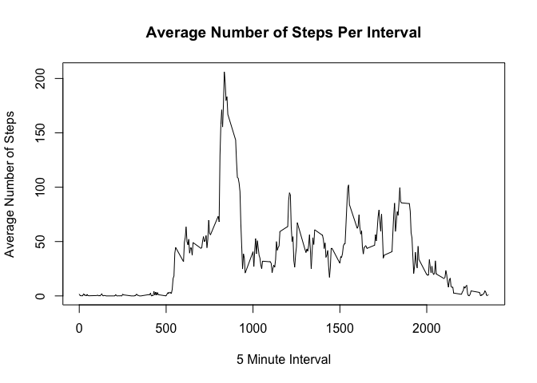
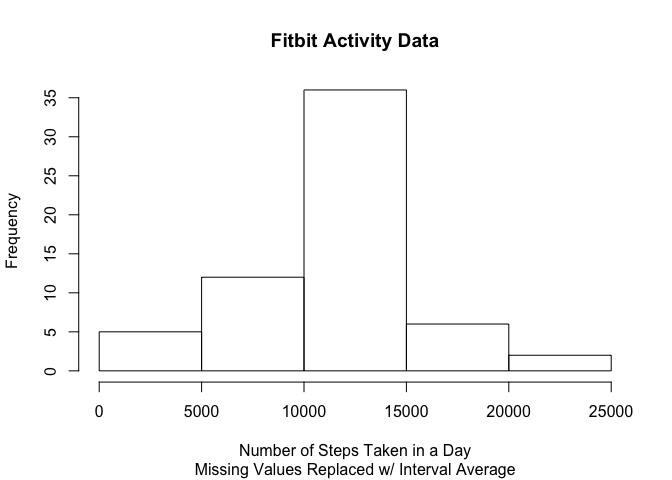
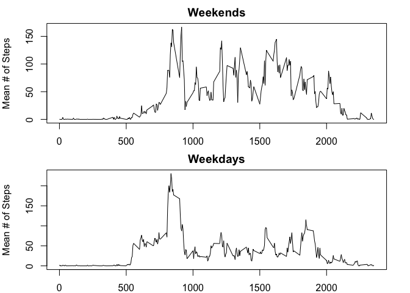

# This is my Course Project 1 and First Markdown Document!

##Loading and Pre-Processing the Data

Read the data from the working directory:

```r
activityData <- read.csv("./activity.csv")
```

Summarize the data to total steps per day:

```r
library(dplyr)
```


```r
sumActivityDay <- summarize(group_by(activityData,date),
    sumSteps=sum(steps,na.rm=TRUE))
```

##What Is the Mean Total Number of Steps Taken Per Day?

Create a histogram of the total number of steps per day:

```r
hist(sumActivityDay$sumSteps,
     main="Fitbit Activity Data",
     xlab="Number of Steps Taken in a Day")
```

\

##What Is the Average Daily Activity Pattern?

First, calculate summary statistics.


```r
meanSteps <- mean(sumActivityDay$sumSteps, na.rm=TRUE)
```
*The mean number of steps is 9354.2295082.*


```r
medianSteps <- median(sumActivityDay$sumSteps, na.rm=TRUE)
```
*The median number of steps is 10395.*

Then, summarize the data to average steps per interval:

```r
sumActivityInterval <- summarize(group_by(activityData,interval),
                          meanSteps=mean(steps, na.rm=TRUE))
```

Create a time series plot of the average numbers of steps per interval:

```r
plot(meanSteps ~ interval, sumActivityInterval,
     main="Average Number of Steps Per Interval",
     xlab="5 Minute Interval",
     ylab="Average Number of Steps",
     type = "l")
```

\

Calculate the maximum of the average number of steps across intervals:

```r
maxSteps <- max(sumActivityInterval$meanSteps)
```
The maximum number of steps is 206.1698113.


```r
maxInterval <- sumActivityInterval[which(sumActivityInterval$meanSteps==maxSteps),"interval"]
```
This maximum occurs in interval number 835.

##Inputing Missing Values

Calculate the total number of missing values in the dataset:

```r
numNAs <- sum(is.na(activityData$steps))
```
The total number of missing values is 2304.

Create a new dataset with the missing values filled in with the interval average:

```r
newActivityData <- arrange(merge(activityData,sumActivityInterval, by = "interval"),date)
newActivityData$steps[is.na(newActivityData$steps)] <-
          newActivityData$meanSteps[is.na(newActivityData$steps)]
```

Re-summarize to the day level:

```r
newSumActivityDay <- summarize(group_by(newActivityData,date),sumSteps=sum(steps, na.rm=TRUE))
```

Create a histogram of the total number of steps per day:

```r
hist(newSumActivityDay$sumSteps,
     main="Fitbit Activity Data",
     sub="Missing Values Replaced w/ Interval Average",
     xlab="Number of Steps Taken in a Day")
```

\

Calculate new summary statistics.


```r
newMeanSteps <- mean(newSumActivityDay$sumSteps, na.rm=TRUE)
```
*The mean number of steps per day is 1.0766189\times 10^{4}.*


```r
newMedianSteps <- median(newSumActivityDay$sumSteps, na.rm=TRUE)
```
*The median number of steps per day is 1.0766189\times 10^{4}.*

The impact of imputing the missing data using the interval average is to increase the mean from 9354.2295082 to 1.0766189\times 10^{4} and the median from 10395 to 1.0766189\times 10^{4}.

##Are There Differences in Activity Levels between Weekends and Weekdays?

Create a new factor level in the dataset with the day of the week:

```r
newActivityData$weekday <- weekdays(as.Date(newActivityData$date))
map <- cbind(c("Monday", "Tuesday", "Wednesday", "Thursday", "Friday", "Saturday", "Sunday"),
             c("weekday", "weekday", "weekday", "weekday", "weekday", "weekend", "weekend"))
map <- as.data.frame(map)
colnames(map)=c("weekday", "group")
newActivityData <- arrange(merge(newActivityData, map, by = "weekday"),date)
```

Summarize to weekday/weekend:

```r
sumActivityGroup <- summarize(group_by(newActivityData, group, interval),
                          newMeanSteps=mean(steps, na.rm=TRUE))
```

Make a panel plot by subset:

```r
par(mfrow=c(2,1),mar=c(2,4,2,2))
weekend <- subset(sumActivityGroup, group=="weekend")
plot(newMeanSteps ~ interval, weekend, main="Weekends", ylab="Mean # of Steps",
     type="l")
weekday <- subset(sumActivityGroup, group=="weekday")
plot(newMeanSteps ~ interval, weekday, main="Weekdays", ylab="Mean # of Steps",
     type="l")
```

\

